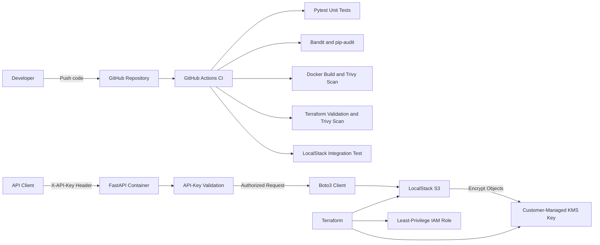

# Secure API DevSecOps Project

[](https://github.com/abdulrahmancoding/secure-api-devsecops/actions/workflows/ci.yml)

A security-focused DevSecOps project demonstrating how to build, test, containerize, scan, and provision cloud infrastructure for a Python API.

The project combines FastAPI, Docker, Terraform, GitHub Actions, and AWS-compatible services running locally through LocalStack. It applies automated security checks throughout the development workflow without requiring a billing-enabled AWS account.

## Project Overview

The API accepts text artifacts and stores them in an S3-compatible bucket protected by a customer-managed KMS encryption key.

Protected API endpoints require a valid API key supplied through the `X-API-Key` request header. Terraform defines the infrastructure and its security controls as code, while GitHub Actions automatically tests and scans every change.

The project demonstrates:

- Containerized API development with Docker
- API-key authentication
- Secure secret management using environment variables and GitHub Actions secrets
- AWS infrastructure provisioning with Terraform
- Encrypted object storage using S3 and KMS
- Least-privilege IAM permissions
- Automated unit testing with Pytest
- Automated LocalStack integration testing
- Dependency vulnerability scanning with pip-audit
- Python static security analysis with Bandit
- Container and Terraform scanning with Trivy
- Continuous integration with GitHub Actions
- Pull-request-based development

## Architecture



### Request Flow

1. A client sends a request to the FastAPI application.
2. The API checks the `X-API-Key` request header.
3. Requests with missing or incorrect credentials are rejected.
4. The API validates the artifact name and content.
5. Boto3 sends the artifact to the local S3-compatible service.
6. S3 encrypts the stored object using the customer-managed KMS key.
7. Authorized clients can list the stored artifact names.

## Security Controls

| Area | Control | Implementation |
|---|---|---|
| API security | API-key authentication | Artifact endpoints require a valid `X-API-Key` header |
| Secret management | Environment isolation | Local secrets are stored in an ignored `.env` file |
| CI secret management | Encrypted repository secrets | API and LocalStack credentials are stored as GitHub Actions secrets |
| Credential comparison | Timing-safe comparison | API keys are checked using `secrets.compare_digest` |
| Data protection | Encryption at rest | S3 objects use a customer-managed KMS key |
| Key management | Automatic key rotation | KMS key rotation is enabled in Terraform |
| Storage security | Public access prevention | All four S3 public-access-block settings are enabled |
| Transport security | HTTPS-only access | The bucket policy denies requests using insecure transport |
| Data recovery | Object versioning | S3 bucket versioning preserves previous object versions |
| Access control | Least privilege | The API role is limited to the required S3 and KMS operations |
| Input security | Request validation | Artifact names and content sizes are restricted using Pydantic |
| Application security | Safe error handling | Storage failures return a controlled HTTP `503` response |
| Container security | Non-root execution | The API container runs as an unprivileged application user |
| Network exposure | Localhost binding | API and LocalStack ports are bound to `127.0.0.1` |
| CI permissions | Read-only repository access | GitHub Actions receives only `contents: read` permission |
| Dependency security | Vulnerability auditing | pip-audit checks production dependencies for known vulnerabilities |
| Source security | Static analysis | Bandit scans Python source code for insecure patterns |
| Image security | Container scanning | Trivy blocks builds containing high or critical vulnerabilities |
| Infrastructure security | IaC scanning | Terraform is formatted, validated, and scanned by Trivy |

## Continuous Integration Pipeline

The GitHub Actions workflow runs on pushes and pull requests targeting the `main` branch.

The workflow is separated into three jobs.

### Application Pipeline

1. Check out the repository without preserving Git credentials.
2. Set up the required Python version.
3. Install the pinned Python dependencies.
4. Audit production dependencies with pip-audit.
5. Scan Python source code with Bandit.
6. Run the automated Pytest suite.
7. Build the Docker image.
8. Scan the completed image with Trivy.

### Infrastructure Pipeline

1. Check out the repository.
2. Install the required Terraform version.
3. Verify Terraform formatting.
4. Initialize Terraform without a remote backend.
5. Validate the Terraform configuration.
6. Scan the infrastructure code for high and critical misconfigurations.

### Integration Test Pipeline

The integration job starts only after the application and infrastructure jobs pass.

It then:

1. Starts a temporary LocalStack environment.
2. Initializes and applies the Terraform configuration.
3. Creates the local S3, KMS, and IAM resources.
4. Sends an authenticated request through FastAPI.
5. Stores an artifact through Boto3 in LocalStack S3.
6. Retrieves the stored object.
7. Verifies its content.
8. Confirms that KMS encryption was applied.
9. Deletes the temporary test object.

A failed test, vulnerability check, container scan, infrastructure scan, or integration test stops the workflow.

## API Authentication

The artifact endpoints require an API key.

Clients must send the key in this HTTP header:

```text
X-API-Key: your-api-key
```

Authentication behavior:

- Missing API key: `401 Unauthorized`
- Incorrect API key: `401 Unauthorized`
- Authentication not configured on the server: `503 Service Unavailable`
- Correct API key: the request continues normally

The `/health` endpoint remains public so monitoring systems can check whether the service is running.

The API key must never be committed to Git or included in screenshots, logs, or documentation.

## API Endpoints

| Method | Endpoint | Authentication | Purpose | Successful response |
|---|---|---|---|---|
| `GET` | `/health` | Public | Check whether the API is running | `200 OK` |
| `POST` | `/artifacts` | API key required | Validate and store a text artifact | `201 Created` |
| `GET` | `/artifacts` | API key required | List stored artifact names | `200 OK` |
| `GET` | `/docs` | Public | Open the interactive API documentation | `200 OK` |

### Example Upload Body

```json
{
  "name": "security-report.txt",
  "content": "No critical vulnerabilities found."
}
```

### Example Authenticated Upload

```bash
curl --request POST \
  --url http://localhost:8000/artifacts \
  --header "Content-Type: application/json" \
  --header "X-API-Key: $API_KEY" \
  --data '{
    "name": "security-report.txt",
    "content": "No critical vulnerabilities found."
  }'
```

Expected response:

```json
{
  "name": "security-report.txt",
  "status": "stored"
}
```

### Example Authenticated Artifact Listing

```bash
curl \
  --header "X-API-Key: $API_KEY" \
  http://localhost:8000/artifacts
```

## Testing Strategy

The automated unit test suite contains eight tests covering:

- API health checking
- Successful artifact uploads
- Artifact listing
- Rejection of unsafe artifact names
- Controlled behavior when storage is unavailable
- Rejection of missing API keys
- Rejection of incorrect API keys
- Controlled behavior when authentication is not configured

Unit tests replace the real storage connection with temporary fake functions. This keeps the basic test suite fast and allows application behavior to be tested without starting LocalStack.

A separate integration test verifies the complete flow:

```text
FastAPI → API-key authentication → Boto3 → LocalStack S3 → KMS encryption
```

Unlike the unit tests, the integration test uses real local infrastructure created by Terraform. It verifies that:

- The authenticated upload request succeeds
- The artifact appears in the S3 bucket
- The stored content matches the uploaded content
- The object uses KMS encryption
- The temporary test object is deleted afterward

Run the unit tests locally with:

```bash
python -m pytest -v
```

Run the LocalStack integration test with:

```bash
RUN_INTEGRATION_TESTS=1 \
AWS_ACCESS_KEY_ID=test \
AWS_SECRET_ACCESS_KEY=test \
AWS_DEFAULT_REGION=us-east-1 \
API_KEY="$API_KEY" \
python -m pytest tests/integration/test_localstack.py -v
```

LocalStack must be running and the Terraform infrastructure must be applied before running the integration test.

## Running the Project Locally

### Prerequisites

Install the following tools before starting:

- Git
- Python
- Docker Desktop with Docker Compose
- Terraform `1.15.8`
- A LocalStack authentication token

No billing-enabled AWS account is required.

### Setup

1. Clone the repository:

```bash
git clone https://github.com/abdulrahmancoding/secure-api-devsecops.git
cd secure-api-devsecops
```

2. Create the local environment file:

```bash
cp .env.example .env
```

3. Open `.env` and configure:

```text
LOCALSTACK_AUTH_TOKEN=your-localstack-token
API_KEY=your-secure-random-api-key
```

Generate a secure API key with:

```bash
python -c "import secrets; print(secrets.token_urlsafe(32))"
```

Never commit `.env`, display its contents publicly, or include its secrets in screenshots.

4. Start LocalStack:

```bash
docker compose up --detach localstack
docker compose ps
```

Wait until LocalStack reports a healthy status.

5. Initialize and apply the Terraform infrastructure:

```bash
terraform -chdir=infrastructure init
terraform -chdir=infrastructure apply
```

Review the plan and enter `yes` when prompted.

6. Build and start the API:

```bash
docker compose up --detach --build api
docker compose ps
```

7. Verify the public health endpoint:

```bash
curl http://localhost:8000/health
```

Expected response:

```json
{"status":"healthy"}
```

8. Load the environment variables into the current terminal:

```bash
set -a
source .env
set +a
```

9. Verify an authenticated endpoint:

```bash
curl \
  --header "X-API-Key: $API_KEY" \
  http://localhost:8000/artifacts
```

10. Open the interactive API documentation:

```text
http://localhost:8000/docs
```

Click **Authorize**, enter the API key, and then test the protected endpoints.

Do not share screenshots containing the generated API key or Swagger curl commands containing the `X-API-Key` header.

### Stop the Environment

```bash
docker compose down
```

The AWS resources exist only inside the local environment and do not create charges in a real AWS account.

## Local Security Checks

Run the same major checks locally before committing changes:

```bash
python -m pytest -v
bandit --recursive app
python -m pip_audit --requirement requirements.txt
terraform -chdir=infrastructure fmt -check
terraform -chdir=infrastructure validate
git diff --check
```

These commands verify application behavior, scan the source code and dependencies, validate the infrastructure, and detect formatting problems.

## Technology Stack

| Category | Technology |
|---|---|
| API | Python, FastAPI, Pydantic |
| Authentication | API key through the `X-API-Key` header |
| AWS integration | Boto3 |
| Containers | Docker, Docker Compose |
| Local cloud environment | LocalStack |
| Infrastructure as Code | Terraform |
| Cloud services | Amazon S3, AWS KMS, AWS IAM |
| Automated testing | Pytest |
| Security scanning | Bandit, pip-audit, Trivy |
| Continuous integration | GitHub Actions |
| Version control | Git and GitHub |

## Repository Structure

```text
secure-api-devsecops/
├── .github/
│   └── workflows/
│       └── ci.yml
├── app/
│   ├── main.py
│   ├── security.py
│   └── storage.py
├── infrastructure/
│   ├── .terraform.lock.hcl
│   └── main.tf
├── tests/
│   ├── integration/
│   │   └── test_localstack.py
│   ├── test_artifacts.py
│   └── test_health.py
├── .dockerignore
├── .env.example
├── .gitignore
├── compose.yaml
├── Dockerfile
├── requirements-dev.txt
├── requirements.txt
└── README.md
```

- `app/main.py` defines the API endpoints and request validation.
- `app/security.py` validates API keys.
- `app/storage.py` connects the application to S3 through Boto3.
- `infrastructure/` contains the AWS-compatible Terraform configuration.
- `tests/` contains the unit and integration tests.
- `.github/workflows/ci.yml` defines the CI and security pipeline.
- `compose.yaml` connects the API container to LocalStack.
- `.env.example` documents the required environment variables without exposing real secrets.

## Current Scope

The project currently provides:

- A containerized FastAPI service
- Protected artifact-management endpoints
- API-key authentication
- Secure S3-compatible artifact storage
- Customer-managed KMS encryption
- Least-privilege IAM resources
- Terraform-based infrastructure provisioning
- Automated unit and integration testing
- Automated source, dependency, image, and infrastructure scanning
- A multi-job GitHub Actions pipeline
- Local development without a billing-enabled AWS account

The infrastructure follows AWS-compatible patterns but has not been deployed to a production AWS environment.

## Future Improvements

Potential future improvements include:

- Adding object download and deletion endpoints
- Replacing the single API key with user-specific authentication and authorization
- Adding API-key rotation and expiration
- Adding rate limiting to protect the API from abuse
- Adding structured security logs and request identifiers
- Adding monitoring, metrics, dashboards, and alerts
- Deploying the container to Amazon ECS or another managed platform
- Using GitHub OpenID Connect for secure AWS deployment authentication
- Storing Terraform state in a secured remote backend
- Adding separate development, staging, and production environments
- Adding automated API documentation and release versioning
- Adding policy-as-code checks with tools such as Checkov or Open Policy Agent

## Learning Outcomes

Building this project provided practical experience with:

- Designing a complete DevSecOps workflow
- Building and containerizing a Python API
- Protecting endpoints with API-key authentication
- Managing secrets safely in local and CI environments
- Provisioning AWS-compatible resources using Terraform
- Applying S3, KMS, IAM, and network security controls
- Writing unit and end-to-end integration tests
- Testing real interactions between FastAPI, Boto3, S3, and KMS
- Scanning source code, dependencies, containers, and infrastructure
- Building multi-job GitHub Actions workflows
- Debugging Docker, WSL, YAML, Terraform, LocalStack, and CI failures
- Using feature branches and pull requests to deliver changes safely