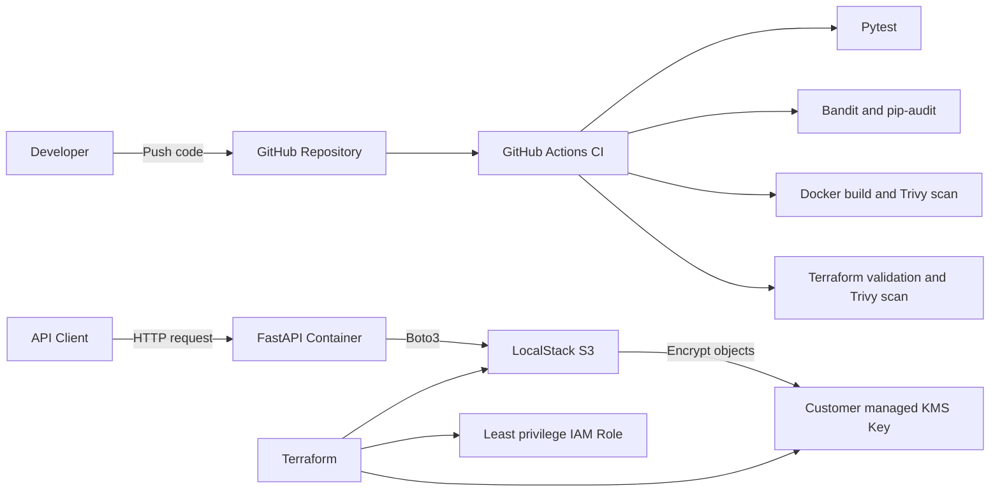

# Secure API DevSecOps Project

[](https://github.com/abdulrahmancoding/secure-api-devsecops/actions/workflows/ci.yml)

A security focused DevSecOps project demonstrating how to build, test, containerize, scan, and provision cloud infrastructure for a Python API.

The project combines FastAPI, Docker, Terraform, GitHub Actions, and AWS compatible services running locally through LocalStack. It applies automated security checks throughout the development workflow without requiring a billing enabled AWS account.

## Project Overview

The API stores text artifacts in an S3 compatible bucket protected by a customer managed KMS encryption key. Terraform defines the infrastructure and security controls as code, while GitHub Actions automatically tests and scans every change pushed to the repository.

The project demonstrates:

- Containerized API development with Docker
- AWS infrastructure provisioning with Terraform
- Encrypted object storage using S3 and KMS
- Least privilege IAM permissions
- Automated testing with Pytest
- Dependency vulnerability scanning with pip audit
- Python static security analysis with Bandit
- Container and Terraform scanning with Trivy
- Continuous integration with GitHub Actions

## Architecture



### Request Flow

1. A client sends an artifact to the FastAPI application.
2. The API validates the artifact name and content.
3. Boto3 sends the artifact to the local S3-compatible service.
4. S3 encrypts the stored object using the customer managed KMS key.
5. The API can list stored artifacts without receiving unnecessary administrative permissions.

## Security Controls

| Area | Control | Implementation |
|---|---|---|
| Data protection | Encryption at rest | S3 objects use a customer managed KMS key |
| Key management | Automatic key rotation | KMS key rotation is enabled in Terraform |
| Storage security | Public access prevention | All four S3 public access block settings are enabled |
| Transport security | HTTPS only access | The bucket policy denies requests using insecure transport |
| Data recovery | Object versioning | S3 bucket versioning preserves previous object versions |
| Access control | Least privilege | The API role can only list the designated bucket, upload objects, and use its specific KMS key |
| Input security | Request validation | Artifact names and content sizes are restricted using Pydantic |
| Application security | Safe error handling | Storage failures return a controlled HTTP 503 response |
| Container security | Non root execution | The API container runs as an unprivileged application user |
| Network exposure | Localhost binding | API and LocalStack ports are bound to `127.0.0.1` |
| CI permissions | Read only repository access | GitHub Actions receives only `contents: read` permission |
| Dependency security | Vulnerability auditing | pip audit checks Python dependencies for known vulnerabilities |
| Source security | Static analysis | Bandit scans Python source code for insecure patterns |
| Image security | Container scanning | Trivy blocks builds containing high or critical image vulnerabilities |
| Infrastructure security | IaC scanning | Terraform is formatted, validated, and scanned by Trivy |

## Continuous Integration Pipeline

The GitHub Actions workflow runs on pushes and pull requests targeting the `main` branch.

### Application Pipeline

1. Check out the repository without preserving Git credentials.
2. Install the pinned Python dependencies.
3. Audit production dependencies with pip-audit.
4. scan Python source code with Bandit;
5. run the automated Pytest suite;
6. build the Docker image;
7. scan the completed image with Trivy.

### Infrastructure Pipeline

1. Install the required Terraform version.
2. verify Terraform formatting;
3. initialize Terraform without a remote backend;
4. validate the Terraform configuration;
5. scan the infrastructure code for high and critical misconfigurations.

A failed test, vulnerability check, or infrastructure scan stops the workflow and prevents the issue from being silently accepted.

## API Endpoints

| Method | Endpoint | Purpose | Successful response |
|---|---|---|---|
| `GET` | `/health` | Check whether the API is running | `200 OK` |
| `POST` | `/artifacts` | Validate and store a text artifact | `201 Created` |
| `GET` | `/artifacts` | List the stored artifact names | `200 OK` |
| `GET` | `/docs` | Open the interactive API documentation | `200 OK` |

Example upload request:

```json
{
  "name": "security-report.txt",
  "content": "No critical vulnerabilities found."
}
```

## Testing Strategy

The automated test suite contains five tests covering:

- API health checking
- Successful artifact uploads
- Artifact listing
- Rejection of unsafe artifact names
- Controlled behavior when storage is unavailable

Unit tests replace the real storage connection with temporary fake functions. This keeps the CI pipeline fast and allows application behavior to be tested without starting LocalStack.

A separate integration test was performed manually to verify the complete flow from FastAPI through Boto3 to LocalStack S3. The uploaded object was then inspected to confirm that it used the customer-managed KMS encryption key.

Run the automated tests locally with:

```bash
python -m pytest -v
```
## Running the Project Locally

### Prerequisites

Install the following tools before starting:

- Git
- Docker Desktop with Docker Compose
- Terraform `1.15.8`
- A LocalStack authentication token

No billing-enabled AWS account is required.

### Setup

1. Clone the repository:

```bash
git clone https://github.com/abdulrahmancoding/secure-api-devsecops.git
cd secure-api-devsecops
```

2. Create the local environment file:

```bash
cp .env.example .env
```

Add your LocalStack token to `.env`. Never commit this file or share its contents.

3. Start the local AWS environment:

```bash
docker compose up --detach localstack
docker compose ps
```

Wait until LocalStack reports a healthy status.

4. Initialize and apply the Terraform infrastructure:

```bash
terraform -chdir=infrastructure init
terraform -chdir=infrastructure apply
```

Review the plan and enter `yes` when prompted.

5. Build and start the API:

```bash
docker compose up --detach --build api
```

6. Verify the service:

```bash
curl http://localhost:8000/health
```

Expected response:

```json
{"status":"healthy"}
```

Open the interactive API documentation at:

```text
http://localhost:8000/docs
```

### Stop the Environment

```bash
docker compose down
```

The AWS resources exist only inside the local environment and do not create charges in a real AWS account.

## Technology Stack

| Category | Technology |
|---|---|
| API | Python, FastAPI, Pydantic |
| AWS integration | Boto3 |
| Containers | Docker, Docker Compose |
| Local cloud environment | LocalStack |
| Infrastructure as Code | Terraform |
| Cloud services | Amazon S3, AWS KMS, AWS IAM |
| Automated testing | Pytest |
| Security scanning | Bandit, pip-audit, Trivy |
| Continuous integration | GitHub Actions |
| Version control | Git and GitHub |

## Repository Structure

```text
secure-api-devsecops/
├── .github/
│   └── workflows/
│       └── ci.yml
├── app/
│   ├── main.py
│   └── storage.py
├── infrastructure/
│   ├── .terraform.lock.hcl
│   └── main.tf
├── tests/
│   ├── test_artifacts.py
│   └── test_health.py
├── .dockerignore
├── .env.example
├── .gitignore
├── compose.yaml
├── Dockerfile
├── requirements-dev.txt
├── requirements.txt
└── README.md
```

- `app/` contains the API and S3 integration code.
- `infrastructure/` contains the AWS compatible Terraform configuration.
- `tests/` contains the automated API tests.
- `.github/workflows/` contains the CI and security pipeline.
- `compose.yaml` connects the API to the local AWS environment.

## Current Scope and Future Improvements

This project intentionally uses LocalStack so the complete workflow can run without a billing-enabled AWS account. The infrastructure follows AWS-compatible patterns, but it has not yet been deployed to a production AWS environment.

Potential future improvements include:

- Deploying the API to Amazon ECS or another managed container platform
- Using GitHub OpenID Connect instead of long-lived deployment credentials
- Adding API authentication and user specific authorization
- Adding structured logs, metrics, and alerts
- Automating the LocalStack integration test inside CI
- Storing Terraform state in a secured remote backend
- Adding object download and deletion endpoints with carefully scoped permissions

## Learning Outcomes

Building this project provided practical experience with:

- Designing a complete DevSecOps workflow
- Connecting a containerized API to AWS compatible services
- Managing infrastructure and security controls using Terraform
- Applying encryption, access control, and least privilege principles
- Separating fast unit tests from full integration testing
- Investigating and fixing failed CI security checks
- Protecting secrets and preventing them from entering version control
- Documenting technical architecture for other developers

## Author

**Abdulrahman Abuzeid**

GitHub: [abdulrahmancoding](https://github.com/abdulrahmancoding)